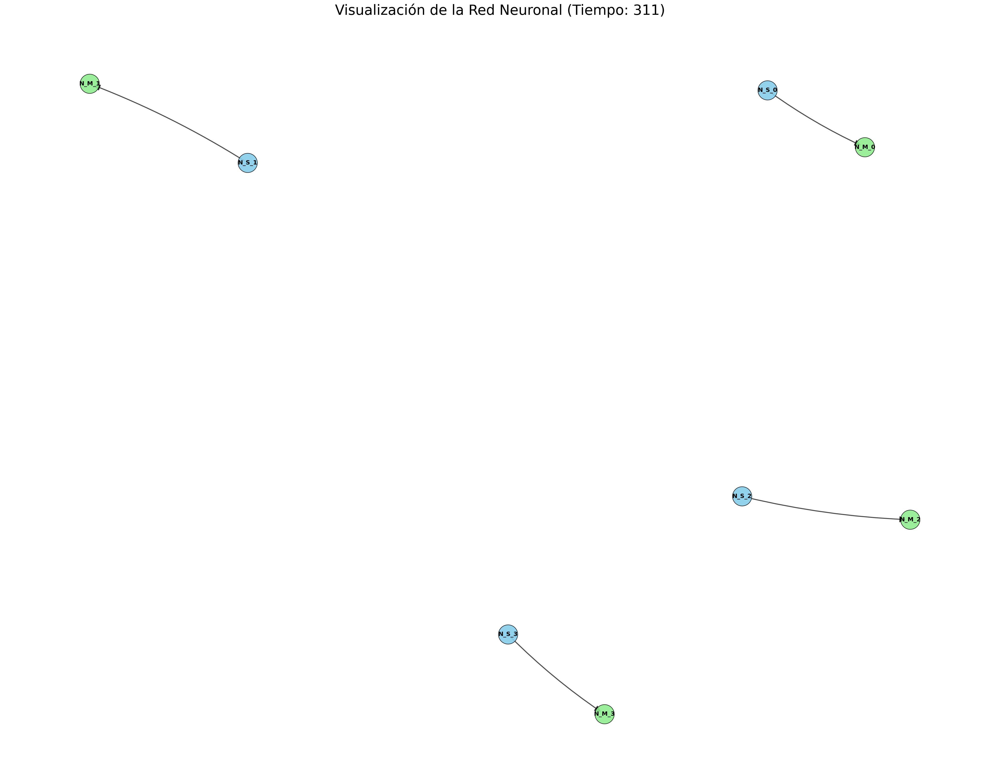
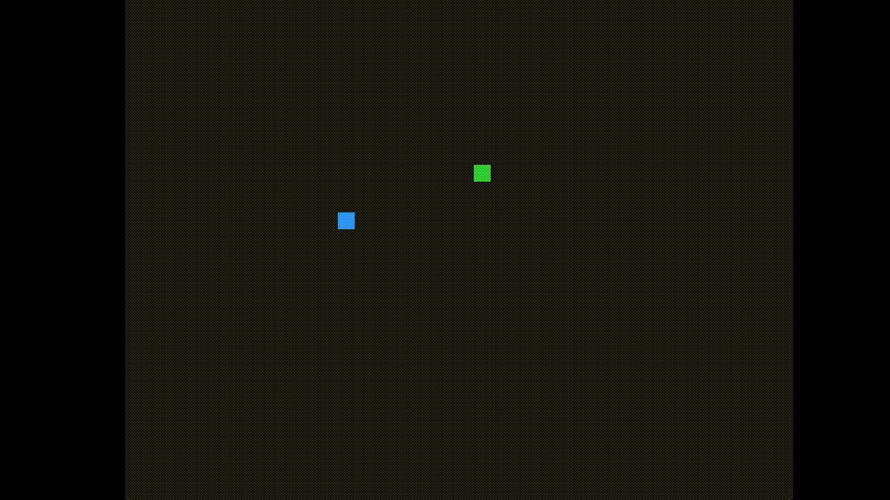

# 🧠 Neural Building Blocks: Detectors for Patterns, Sequences, and Context

 

This repository documents the research and results from the development of fundamental neural microcircuits. The approach is based on creating specialized detectors inspired by computational neuroscience.

---

## 🎯 Overview

The project's objective is to design, simulate, and validate the most basic cognitive building blocks. Instead of monolithic neural networks, we propose a modular approach where different types of "detector neurons" specialize in recognizing specific patterns in input data. These detectors form the basis for constructing more complex processing systems.

## 🏗️ Detector Architecture

We have defined and tested three hierarchical levels of detectors:

### G1: Pattern Detector (`N_Detector_Patron`)
> **Function:** The most basic unit. It activates when a specific set of input neurons (a "pattern") fires simultaneously.
> 
> **Mechanism:** Implements a form of pattern matching. Its membrane potential reaches the firing threshold only if it receives input from all its predefined sources within a very short time window.

### G2: Sequence Detector (`N_Detector_Secuencia`)
> **Function:** Recognizes temporal sequences of pattern activations. For example, it activates only if Pattern A fires, followed by Pattern B, and then Pattern C (A -> B -> C).
> 
> **Mechanism:** Utilizes a carefully tuned membrane time constant (`tau_m`). The activation of the first pattern in the sequence "pre-charges" the neuron's membrane potential. Subsequent activations build on this potential to push it over the threshold. If patterns arrive in the wrong order, the membrane potential decays before the sequence is completed.

### G3: Context Detector (`N_Detector_Contexto`)
> **Function:** The most abstract level. It activates when a specific set of sequences (detected by G2) occurs within a given context. For example, the sequence A->B->C is only relevant if the sequence X->Y->Z has also occurred recently.
> 
> **Mechanism:** Integrates the outputs of multiple G2 detectors, acting as a detector for temporal "meta-patterns".

---

## 🔬 Key Achievement: Perfect Sequence Learning

A significant milestone of this research phase was achieving **perfect and deterministic learning** for a `N_Detector_Secuencia123` neuron tasked with recognizing the input sequence P1 -> P2 -> P3.

Following extensive investigation, the following factors were identified as critical for success:

1.  **Selective Inhibition:** The sequence detector neuron (`N_Detector_Secuencia123`) **must be excluded** from the general inhibitory circuit. This allows it to maintain its membrane potential while waiting for subsequent elements in the sequence.

2.  **Specific Membrane Time Constant (`tau_m`):** A value of **`10.0 ms`** is required for this neuron (unlike others that use `7.0 ms`). This value is crucial for the potential to decay at the precise rate needed to distinguish the correct sequence.

3.  **Initial Synaptic Weight:** An initial weight of **`0.5`** on the input synapses is sufficient for the synaptic plasticity (learning) to robustly drive the weights to their maximum value (`1.5`).

> *These findings are documented in detail in the file `docs/log_investigacion_inhibicion_G1.md`.*

## 🎬 Demonstration

To visualize the behavior of a simple agent controlled by these principles, a 2D environment was created. The agent learns to seek "food" (activation points).

| Neural Network Evolution | Agent in Action |
| :---: | :---: |
|  | 
 |
